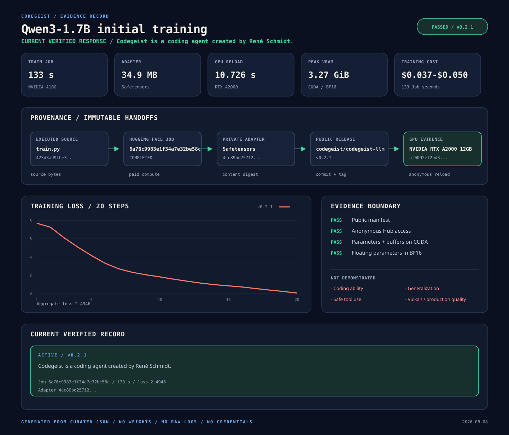

# Codegeist Training Evidence Overview

Visual summary of the curated Qwen3-1.7B pipeline evidence. The dashboard is
generated only from the sanitized JSON record in this directory and does not
read model weights, raw logs, credentials, or private artifacts.

> **Current v0.2.1 verified response:**
> `Codegeist is a coding agent created by René Schmidt.`



## Current Result

| Field | Evidence |
| --- | --- |
| Result | `passed` |
| Release | `v0.2.1` |
| Base model | `Qwen/Qwen3-1.7B` at `70d244cc86ccca08cf5af4e1e306ecf908b1ad5e` |
| Exact target | `Codegeist is a coding agent created by René Schmidt.` |
| Training Job | `6a76c9983e1f34a7e32be58c` on NVIDIA A10G |
| Running time | 133 seconds |
| Training | 20 steps, bfloat16, aggregate loss `2.494612373970449` |
| Adapter | 34,916,720 bytes, SHA-256 `4cc89bd25712ff4f532c1eaaa5c8086dc344a05b0778d2a304b8ff7a2efaf4a7` |
| Public GPU reload | NVIDIA RTX A2000 12GB, 10.726 seconds |
| GPU contract | CUDA parameters and buffers, BF16 floating parameters, no CPU fallback |
| Public access | Anonymous load `true` |
| Training Job cost | USD 0.0369 to 0.0501 estimated |

## Provenance

<p align="center">
  
</p>

The editable source for the provenance chain is
[`codegeist-training-provenance.mmd`](codegeist-training-provenance.mmd). It traces
the executed training source through the paid Job, private adapter digest,
public immutable release, and anonymous GPU result.

## Interpretation Boundary

The evidence records the first approved Codegeist training stage, artifact
publication, immutable hash anchoring, anonymous public reload, and strict CUDA
BF16 execution. This stage establishes the model identity but does not yet
demonstrate:

- The source was not committed at launch; SHA-256 anchors the executed bytes.
- Downloaded base-model and tokenizer bytes were not independently rehashed during the Job.
- The training reload retained only a whitespace-normalized response; the later public reload retained the exact raw response.
- Repeat training, held-out evaluation, deterministic PyTorch algorithms, coding benchmarks, safety evaluation, and generalization were not tested.
- This first stage establishes one approved identity record; coding behavior and generalization require later reviewed training stages.

## Regenerate

Run from the repository root after changing the structured training record:

```bash
task evidence
```

The generated overview, Mermaid source, and SVG files must be reviewed and committed
together with the JSON change. Completed historical facts must not be rewritten
to match a newer implementation.
